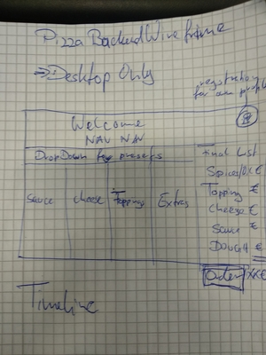

# Project log

17Dec'19 - some 3 hours
Rushed into the project by starting with the "uninteresting" stuff because I waited for Eva to give me research material regarding DOM
 - Set up Repo with index.html, normalize.css, style.css & README.md
 - Started to build parts of the front end (parts of the page + wireframe) 

18Dec'19
- Changed this readme log to Eva's template - 0.5h

 ---------------
## TODO (just for me)

- Challenges + lessons learned (bottom)
- Achievements (bottom)
- Buddy sign-off (bottom)
-----------------
## Overview

Creating a small page for ordering pizza
Initial idea from Robert in this repo: https://github.com/losrobbos/fbw17-lots/blob/master/projects/README.md

## Details

- This project is an exercise to push myself to research more into practical usage of JS
- Design is secondary

### Rough Concept:

- Web site to create own pizza by choosing ingredients
- one-click-selector for popular pizza (presets)
- Different categories of ingredients
- each ingredient with its own prize
- filter ingredients (veggie, vegan option)
- option between pickup or delivery
- Categories
  - dough
  - different kinds of sauce
  - toppings
    - different kinds of cheese
    - d. k. o. ham/sausage
    - shrooms
    - d. k. o. salad (e.g. ruccola)
  - spices(like oregano)
  - flavoured oils (e. g. chilli, garlic)
- Shows order with final prize + shipping

### Bonus

- add pizza to shopping cart
- make another pizza or just x2
- safe own preset (cookies)
- option to work on an already locked pizza again

## Wireframes

## What to Research:

- How to use javascript infrastructure with html buttons'n'shit  
  (select/deselct into ingredients array or smth. like that)
- How to display results on the web site

## Time

Estimated time: 1 Week beginning on Tuesday, 17th Dec. 2019,
Personal goal since it is Christmas/NYE: Getting it done before NYE

- 3h Building Frontend 
- 5h Research DOM
- 5h Building and implementing Backend
- 2h Polishing (Bonus)

## New skills

- DOM
- Building an UI where the user can interact with the Backend built in JS

## Challenges + lessons learned

(What didn't go well? How would you advise future-you so it goes better next time?)

## Achievements

(What did you do this time that was an improvement on last time? Acknowledge your progress, you've earned it!)

## Buddy sign-off

(get together with your buddy, check each other's logs for completeness, talk through your projects as a pair. Include their name here once you're finished.)
